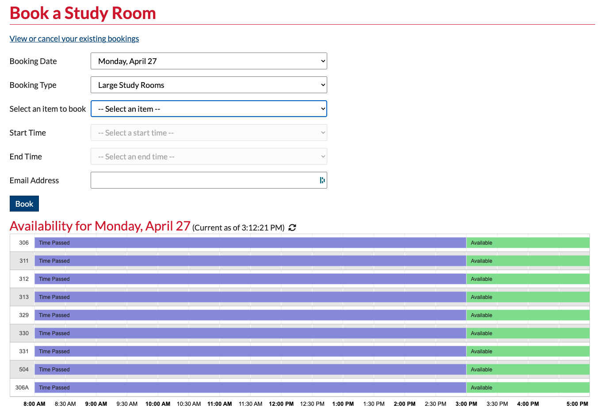

# Alma Booking Program

This program was created for booking study rooms, but can also be used for other bookings if desired

## How It Works

This program uses Alma as a datasource, and allows patrons to book items from a library catalog with a user interface designed around seeing multiple items and availabilities all in one place, which is a feature missing in Alma.

Items booked in this system will create a booking request in Alma. Once the booking is made, the rest of the process is handled by library staff using the Alma web interface.

### Who Can Book

Booking requests are validated by Alma to ensure that the entered email address has permission to book. The program does not require a password, to create a booking, but is limited by other restrictions put on bookings in Alma. For example, yo ucan restrict which patron types can book in Alma to do things like allowing students but blocking faculty.

In order for a patron to book with their email address, their email address needs to be entered into their identifier tab in Alma. The ID Type does not matter, only the value, so you can also book with a barcode or any other ID you have in Alma.

### Staff Use

#### Staff Creating Bookings

Because the user does not need to enter a password, staff can easily book on behalf of a patron. Bookings can be created directly in Alma and this booking program should be updated to indicated that, but it is also meant to be used by staff to simplify their processes.

Because the user field will accept any of the patron's identifiers stored in Alma. This allows you to also use things like the patron's barcode, which allows library staff to simply scan their library card instead of typing in an email address.

If you set the `$remove_non_emails` option in the config file to true, it will remove the patron's identifier on form submission. This is intended for staff who will be scanning cards, and don't want to leave the previous patron's ID in that field, while still leaving email addresses so that students booking for themselves can book multiple slots without having to keep typing their email address.

#### Staff View

By appending `?view=staff` to the URL you are presented with a bit more information that may be helpful for staff but not necessary for students. This includes:

- Showing Booked/Loaned instead of Unavailable
- Showing Overdue loans instead of the default Time Passed block

There is no validation for this page, and it can be disabled in your `config.php`. See "Alternate Views" below for more information.

#### Logging

The program logs activity to the `logs` directory. This is set up as a Docker volume so the logs will be synced to your machine.

Note that logs contain IP addresses, and other potentially identifiable data points. 

### Caching

In order to keep hits to the Alma API to a minimum this program caches data regularly. The cache should always be in sync with the data in Alma, but can be manually cleared by visiting the `clear-cache.php` page in the API directory. 

Cache times and IP restrictions on cache clearing can be modified in the `config.php` file.

### Webhooks

Webhooks must be set up in Alma in order to use them. The booking program supports loan and request webhooks, which trigger when a loan or booking is created/edited/deleted in Alma, and updates the booking cache accordingly so that the booking program is kept in sync with the Alma database without having to constantly poll the API for updated information.

Webhooks are set up in Alma under "Integration Profiles":

- You should set up one webhook for loans and one for requests.
- The listener URL should be [URL of booking app]/webhooks/loan-webhook.php and [URL of booking app]/webhooks/request-webhook.php
- The secret should be the same for both webhooks, and can be entered into your `config.php` file.
- Message type should be JSON and subscriptions should be set to Yes for loans or requests and No for the rest

See https://developers.exlibrisgroup.com/alma/integrations/webhooks/ and https://knowledge.exlibrisgroup.com/Alma/Product_Documentation/010Alma_Online_Help_(English)/090Integrations_with_External_Systems/030Resource_Management/300Webhooks for more information.

### Features / Restrictions

The following items are a list things that may be specific to your library, and whether they are supported or tested

#### Booking Blocks That Aren't 30 Minutes

Bookings can only be created in 30 minute blocks. However, if the library does not close on at XX:00 or XX:30 the program will still work. Examples would include closing at 11:59 instead of midnight because of the way Alma's hours work.

#### Future Bookings

Due to the restrictions of the Alma API the maximum number of days in the future you can book with this program is 28. If you need more than that, the program would have to be modified to perform multiple API calls per lookup.

#### Multiple Open and Close Per Day

This has been addressed, so that if your library closes for part of the day then reopens, the program should handle it appropriately.

#### Closing After Midnight

This has been addressed. There is a configuration variable called $hours_offset that tells the program when it should show the following day's availability.

For example, if you set this variable to 2AM it will continue to show the previous day's availabiility after midnight until 2AM, at which point it will tick over to the current day. This way if your library is open until 1 or 2 AM the hours past midnight will be listed with the day where that block of hours started.

Note that this may cause issues if your library opens at midnight. This has not been tested.

#### Multiple Libraries

No support implemented. The system only supports one library code. You should be able to spin up another instance of this program for each library code, though this has not been tested.

### Automation

A sample crontab is provided to show how to run automations. You can rename this to `crontab` and  edit it to modify when the following automations run.

You likely will want to only run automations in production and not in development, as it will be better for logging and troubleshooting if they are only run from one machine.

#### Overdue Booking Notifications

When `check-overdue.php` runs, it checks if any items in the program are overdue and if it finds any it logs it and sends an email to the addresses listed in `config.php`.

#### Deleting Bookings That Were Not Picked Up

When `remove-late-bookings.php` runs, it checks if any bookings have not yet been turned into loans (eg. no one came to pick them up). If it finds any bookings that are a certain number of seconds (specified in `config.php`) past their start time, it will delete the bookings, freeing up the item to be booked by someone else.

## Alma Setup

Before this program can be used, some setup is required within Alma.

Your items should be set up with a "Terms of Use" that matches the settings in `config.php`. Specifically, you want to make sure the booking limits in Alma are at least as permissive as they are in `config.php` (eg. max booking length in Alma is the same or longer than `$booking_length` and future limit is at least as long as `$days_to_book`)

## Running The Program

### Create Your Config File

Before you can start the program you need to rename the file in the secrets directory called `sample.config.php` to `config.php` and modify it to contain your own configuration. This file is commented with instructions on what should go in each of the variables.

Note: Many of these variables will be added to JavaScript or HTML files, which can expose them to your users. The exposed variables should not contain any sensitive information, but are mentioned here for transparency. The only variables that should contain any sensitive data (and are therefore not exposed) are:
- `$api_key`
- `$admin_email`
- `$webhook_secret`

### Docker

If using Docker you can start the program by:

1. Clone the repo
2. Copy `secrets/sample.config.php` to `secrets/config.php` and edit as needed
3. Copy `docker-compose.override.yml.example.dev` to `docker-compose.override.yml` and edit as needed
  a. In production use `docker-compose.override.yml.example.prod` instead
    1. You will need to replace the example domain with the domain you are going to use for your booking page
4. Run `docker-compose up -d`

### Manual Install

This program should be fairly straightforward to run without Docker. Some of the paths may need to be changed in `config.php`, and care should be taken to move some of the sensitive files outside the directory that is accessible via the web.

One note for manual installs is the `clear-cache.php` file uses trusted headers set by Traefik to validate that the request is coming from specific IP addresses. Without Traefik, this can be spoofed by the user. If running without Traefik, it is recommended to block `clear-cache.php` entirely, or change it to not use `HTTP_X_FORWARDED_FOR`.

## Alternate Views

The config file has support for different views which have different wording and color schemes in the availability chart.

The intention is that we can use this to create a staff view that shows when something is overdue, and differentiates between booked and loaned, where the normal view just shows available or not. This is how it is set up in the sample config.

This could also be used for other things if you wanted to. For example, having a colorblind friendly color scheme or multiple language options. You can create as many views as you like, and access them by appending ?view=[name of view] to your URL

Note: There is no added security stopping patrons from viewing these pages.

## Styling The Page

This program is intentionally left bare so that it can be inserted into an existing website, or styled using custom HTML. If you look at `index.php` you will see that it loads two files if they exist: `before-content.php` and `after-content.php`. These files should be placed in the `php-includes` directory. You can use these two files to insert whatever php/html/javascript/css you want to add as a wrapper to the booking program. Basic samples are included.

### Styling The Popups

We also pull in a small subset of the Bootstrap CSS for styling the popup and button. This is in the file called `bootstrap-modified.css`

### Styling The Timeline

The default timeline wording and colors can be changes in `config.php` as specified in the "Alternate Views" section above.
